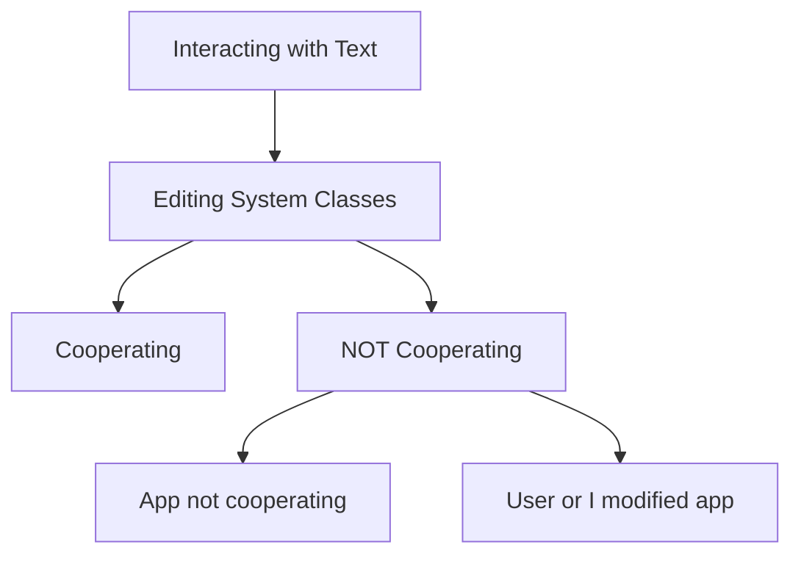
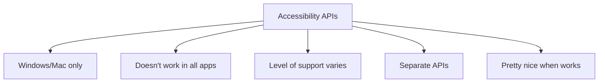
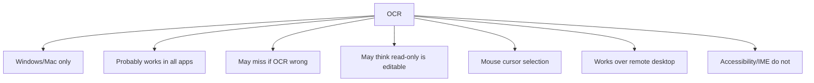
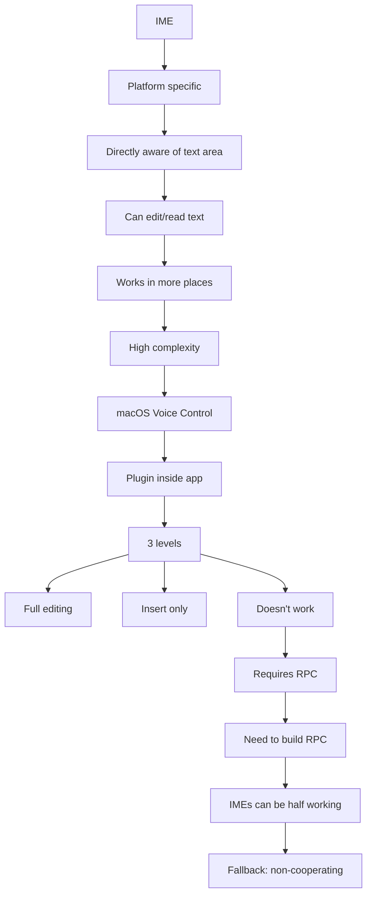
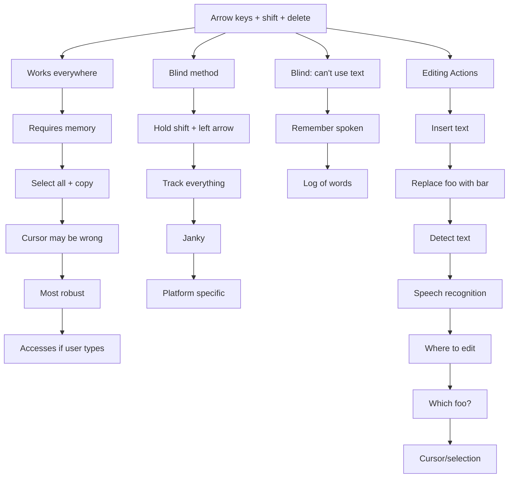
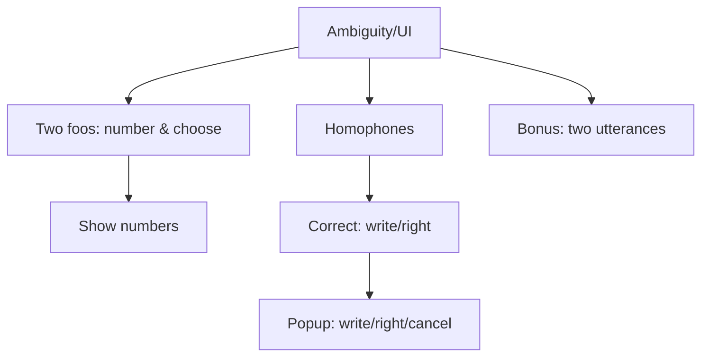
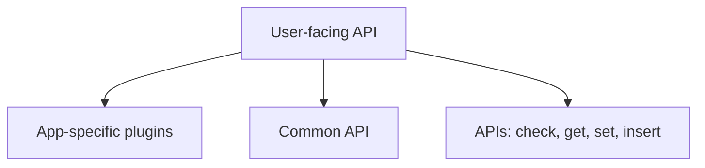
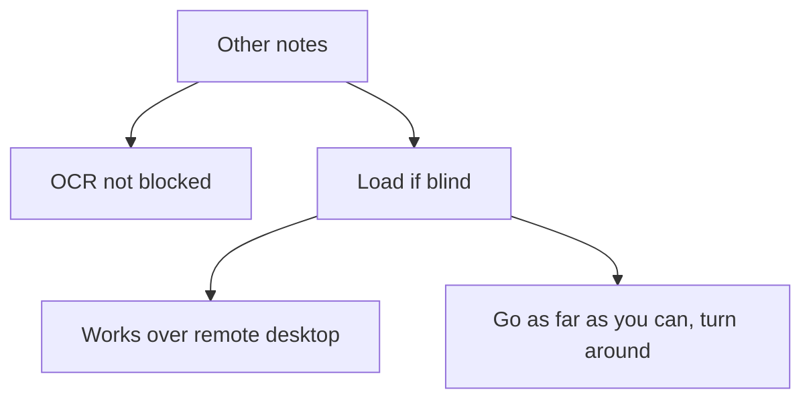

# Interacting with Text (Outline)

## Main Topics
- Two classes of editing system
  - Application is cooperating
  - Application is NOT cooperating
    - Application was not cooperating
    - No user or I modified the app to cooperate
- Accessibility APIs
  - Windows and Mac only (no Linux)
- OCR
  - Windows and Mac only (for now)
  - Probably works in all apps
  - Might "miss" if OCR is wrong or if it thinks words are in the slightly wrong place
  - Might think read-only text is editable (like on a website)
  - Allows Talon to use mouse cursor to select, which is "faster than keyboard"
  - Works over remote desktop
  - Accessibility and IME do not
- IME (Input Method Editor)
  - Platform specific, but PROBABLY available on all platforms
  - No idea what Linux does but surely these exist to some degree
  - No idea how well this works on Windows yet
  - Directly aware of active text area
  - Can perform edits and read text
  - Works in more places than accessibility API
  - Downside: high complexity to build
  - This is how macOS Voice Control does it
  - It's a plugin that lives inside the app hosting the text box
  - 3 levels of IME support
    - Full editing: can view all text, delete, insert at any position
    - Insert only: can stage text, can edit during staging, can't edit old text
    - Doesn't work at all
  - Why don't I already have an IME?
    - Requires RPC, don't have that yet
  - What will it take to make one?
    - Need to build RPC
  - How will IMEs fail / what downsides?
    - Don't work at all or worse: staged desktop
    - Probably won't work in games
    - Will work in some apps, but will work in more apps than accessibility
    - One of the app designs that's most likely to fail unfortunately, is programming IDEs (we can punt this because users use assists)
    - I also don't have a working IME yet so I don't really know where it's going to break
    - I could prototype an IME that doesn't take RPC to Talon just to see where it works
  - IMEs can be half working, where they only edit very recent "active" text
    - Not sure that has been confirmed yet, let's wait until later
  - How do we fall back to when it's not working?
    - Non-cooperating system
- Arrow keys + shift + delete
  - Works in all apps / operating systems
  - Requires you to remember what's there
  - You can get around remembering what's there via select all + copy, but that messes up your cursor and is weird if there's too much text
  - Usually the most robust and boring option
  - The text cursor may not end up where you expect, which can mess up your next edits
  - Accesses if the user types on others
- There's a way to do this blind, without remembering anything, by holding shift and pressing left arrow, and repeatedly getting selected text via copy
  - Main benefit: it works everywhere
  - Downside: you need to track everything and do seeking
  - And it's janky
    - Can detect designs, but becomes platform specific problem with more engineering/research
- If we're blind, we can't use the text to influence spoken commands
  - To be half blind, we can just remember everything they spoke recently
  - All recently inserted text, put it in a big log of words
- The word they're looking for might be to the right we don't know, then we give up and turn around
- How much do we care about the user normally interacting, how much do we care about the user NOT interacting, but Talon still being surprised by something (say, if you're in google docs and someone else edits)

## Editing System Classes

## Accessibility APIs

## OCR

## IME (Input Method Editor)

## Arrow Keys, Blind Methods, and Editing Actions

## Ambiguity / UI

## User-facing API

## Other notes

