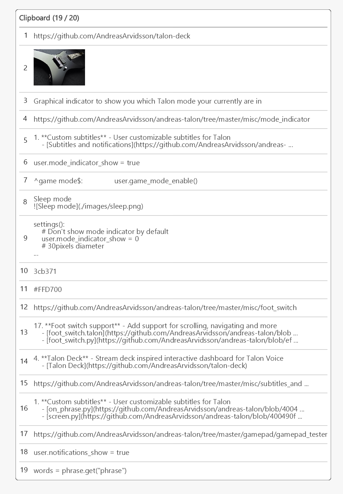

# Clipboard manager

Talon built clipboard manager. Supports copying and pasting multiple things at once.

## Demo

[YouTube - Clipboard manager demo](https://youtu.be/eQ0mlJedixw)

## Dictation Clipboard Pollution Fix

This clipboard manager now includes filtering to prevent dictation operations from polluting your clipboard history. This addresses the issue where Talon's internal dictation functionality would create unwanted clipboard entries for each sentence.

### Settings

- `user.clipboard_manager_ignore_dictation` (default: `true`) - Prevents clipboard changes during dictation and mixed modes from being captured
- `user.clipboard_manager_min_time_between_updates` (default: `0.5`) - Minimum time in seconds between clipboard updates to filter out rapid internal operations

### Commands

- `clippy toggle dictation filtering` - Toggle dictation filtering on/off at runtime

### How it works

The filter uses multiple strategies:
1. **Mode detection**: Skips clipboard monitoring when in dictation or mixed modes
2. **Time-based filtering**: Ignores rapid clipboard changes (less than 0.5 seconds apart)
3. **Content filtering**: Filters out very short non-alphanumeric content that's likely from internal operations
4. **Existing Rango filtering**: Continues to filter out Rango extension messages

You can disable this filtering by setting `user.clipboard_manager_ignore_dictation = false` in your settings if you prefer to capture all clipboard operations.
